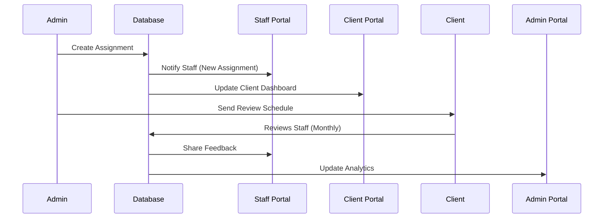
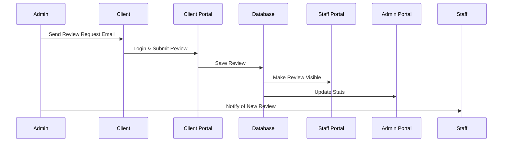

# 🔄 3-Portal System: Data Flow & Access Control Map

**Project:** Shore Agents - Gamified Staff Management Platform  
**Last Updated:** October 13, 2025

---

## 🎯 Overview

This document maps out **WHO SEES WHAT** across our 3-portal system:
- 🔴 **Admin Portal** - System-wide management (Shore Agents Management)
- 🔵 **Staff Portal** - Offshore staff members (Day-to-day work)
- 🟢 **Client Portal** - Client organizations & their users (Review & feedback)

---

## 📊 Feature-by-Feature Breakdown

### 1. 👥 **STAFF MANAGEMENT**

#### Admin Portal View
- **What They See:** All staff members across all clients
- **Permissions:**
  - ✅ Create new staff accounts
  - ✅ Edit staff details (name, email, role, department, skills)
  - ✅ Assign staff to clients
  - ✅ Deactivate/reactivate staff
  - ✅ View staff performance metrics
  - ✅ Change staff roles (STAFF, TEAM_LEAD, MANAGER)
  - ✅ View full staff history & activity logs

#### Staff Portal View
- **What They See:** Their own profile only
- **Permissions:**
  - ✅ View their profile details
  - ✅ Update avatar/bio
  - ✅ View their assignments
  - ✅ View their performance stats
  - ✅ View their gamification progress
  - ❌ Cannot see other staff members
  - ❌ Cannot edit role/department

#### Client Portal View
- **What They See:** Only staff assigned to their organization
- **Permissions:**
  - ✅ View assigned staff profiles
  - ✅ View staff performance metrics (limited)
  - ✅ Submit reviews for assigned staff
  - ❌ Cannot edit staff details
  - ❌ Cannot see staff from other clients
  - ❌ Cannot assign/unassign staff

---

### 2. 🏢 **CLIENT ORGANIZATIONS**

#### Admin Portal View
- **What They See:** All client organizations
- **Permissions:**
  - ✅ Create new client organizations
  - ✅ Edit client details
  - ✅ View client contracts & billing
  - ✅ Assign staff to clients
  - ✅ View all client users
  - ✅ Deactivate clients

#### Staff Portal View
- **What They See:** Clients they are assigned to
- **Permissions:**
  - ✅ View client contact info
  - ✅ View their tasks for that client
  - ✅ Upload documents for client
  - ❌ Cannot edit client details
  - ❌ Cannot see unassigned clients

#### Client Portal View
- **What They See:** Their own organization only
- **Permissions:**
  - ✅ View their company profile
  - ✅ View organization stats
  - ❌ Cannot edit organization details (admin only)
  - ❌ Cannot see other organizations

---

### 3. 👤 **CLIENT USERS**

#### Admin Portal View
- **What They See:** All client users across all organizations
- **Permissions:**
  - ✅ Create client user accounts
  - ✅ Edit user details
  - ✅ Assign users to client organizations
  - ✅ Set user roles (Admin, Manager, User)
  - ✅ Deactivate users
  - ✅ View user activity logs

#### Staff Portal View
- **What They See:** Client users they work with
- **Permissions:**
  - ✅ View client user contact info
  - ✅ See who will review them
  - ❌ Cannot edit client users
  - ❌ Cannot create client users

#### Client Portal View
- **What They See:** Users within their organization only
- **Permissions:**
  - ✅ View other users in their org (if Admin)
  - ✅ Update their own profile
  - ❌ Cannot see users from other orgs
  - ❌ Cannot create users (Admin portal only)

---

### 4. 📋 **ASSIGNMENTS** (Staff → Client Assignments)

#### Admin Portal View
- **What They See:** All assignments across all clients
- **Permissions:**
  - ✅ Create new assignments
  - ✅ Assign staff to clients
  - ✅ Set assignment types (Full-time, Part-time, Project-based)
  - ✅ Set start/end dates
  - ✅ Configure review schedules
  - ✅ Bulk assign staff
  - ✅ View assignment history

#### Staff Portal View
- **What They See:** Their own assignments only
- **Permissions:**
  - ✅ View current assignments
  - ✅ View assignment details (client, role, dates)
  - ✅ See upcoming review dates
  - ❌ Cannot create assignments
  - ❌ Cannot change assignments
  - ❌ Cannot see other staff assignments

#### Client Portal View
- **What They See:** Staff assigned to their organization
- **Permissions:**
  - ✅ View current staff assignments
  - ✅ See staff roles & responsibilities
  - ✅ View assignment timelines
  - ❌ Cannot create/modify assignments
  - ❌ Cannot see assignments for other clients

---

### 5. ⭐ **REVIEWS & PERFORMANCE**

#### Admin Portal View
- **What They See:** All reviews across all staff & clients
- **Permissions:**
  - ✅ View all submitted reviews
  - ✅ See pending reviews
  - ✅ View overdue reviews
  - ✅ Send review requests to clients
  - ✅ View review trends & analytics
  - ✅ Export review data
  - ✅ Override review schedules

#### Staff Portal View
- **What They See:** Reviews about themselves
- **Permissions:**
  - ✅ View their own reviews
  - ✅ See review scores/ratings
  - ✅ Read client feedback
  - ✅ View review history
  - ✅ Track review trends
  - ❌ Cannot see reviews of other staff
  - ❌ Cannot edit reviews

#### Client Portal View
- **What They See:** Review forms for their assigned staff
- **Permissions:**
  - ✅ Submit performance reviews
  - ✅ Rate staff on multiple criteria
  - ✅ Provide written feedback
  - ✅ View review history they submitted
  - ✅ Edit draft reviews
  - ❌ Cannot see reviews from other clients
  - ❌ Cannot review unassigned staff

**Data Flow:**
```
Admin → Sends Review Request
Client → Submits Review
Staff → Views Their Review
Admin → Views All Reviews & Analytics
```

---

### 6. ✅ **TASKS & TO-DO'S**

#### Admin Portal View
- **What They See:** All tasks for all staff
- **Permissions:**
  - ✅ Create tasks for any staff
  - ✅ Assign tasks to staff
  - ✅ Set task priorities & deadlines
  - ✅ View task completion rates
  - ✅ Delete/modify any task
  - ✅ View task analytics

#### Staff Portal View
- **What They See:** Their own tasks only
- **Permissions:**
  - ✅ View assigned tasks
  - ✅ Create personal tasks
  - ✅ Mark tasks complete
  - ✅ Update task status
  - ✅ Set priorities
  - ✅ Add task notes
  - ❌ Cannot see other staff tasks
  - ❌ Cannot assign tasks to others

#### Client Portal View
- **What They See:** Limited visibility
- **Permissions:**
  - ❌ Cannot see staff tasks (internal only)
  - 🔮 **Future:** Could request tasks from staff

**Data Flow:**
```
Admin → Creates Task → Staff Views & Completes
Staff → Creates Own Tasks → Manages Them
```

---

### 7. ⏱️ **TIME TRACKING**

#### Admin Portal View
- **What They See:** All time entries for all staff
- **Permissions:**
  - ✅ View all time logs
  - ✅ See clock-in/clock-out times
  - ✅ Calculate billable hours
  - ✅ View time by client
  - ✅ Export timesheet data
  - ✅ Edit/correct time entries
  - ✅ View time analytics

#### Staff Portal View
- **What They See:** Their own time entries
- **Permissions:**
  - ✅ Clock in/out
  - ✅ View their time logs
  - ✅ Edit recent entries (if enabled)
  - ✅ View daily/weekly/monthly totals
  - ✅ Track idle time
  - ❌ Cannot see other staff time logs

#### Client Portal View
- **What They See:** Aggregated time reports
- **Permissions:**
  - ✅ View hours logged by assigned staff
  - ✅ See time breakdown by project
  - ✅ Export time reports
  - ❌ Cannot see real-time tracking
  - ❌ Cannot edit time entries

**Data Flow:**
```
Staff → Tracks Time → Admin Views All → Client Views Summary
```

---

### 8. 🎮 **GAMIFICATION & POINTS**

#### Admin Portal View
- **What They See:** All gamification data
- **Permissions:**
  - ✅ View leaderboards
  - ✅ Award bonus points
  - ✅ Create achievements
  - ✅ Set point values
  - ✅ View engagement analytics
  - ✅ Reset/adjust points

#### Staff Portal View
- **What They See:** Their own progress & leaderboard
- **Permissions:**
  - ✅ View their points/level
  - ✅ See earned achievements
  - ✅ View leaderboard position
  - ✅ Track daily/weekly/monthly progress
  - ✅ See point history
  - ✅ Compare with peers (anonymized)

#### Client Portal View
- **What They See:** Limited/no access
- **Permissions:**
  - ❌ Cannot see gamification (internal motivation only)
  - 🔮 **Future:** Could see staff engagement scores

**Data Flow:**
```
Staff → Earns Points → Views Progress
Admin → Monitors Engagement → Awards Bonuses
```

---

### 9. 📁 **DOCUMENTS**

#### Admin Portal View
- **What They See:** All documents
- **Permissions:**
  - ✅ Upload documents
  - ✅ Categorize (Contract, Invoice, Report, Other)
  - ✅ View all documents
  - ✅ Delete documents
  - ✅ Set document visibility
  - ✅ Assign documents to clients/staff

#### Staff Portal View
- **What They See:** Documents relevant to them
- **Permissions:**
  - ✅ Upload documents
  - ✅ View documents assigned to them
  - ✅ Download documents
  - ✅ View client-specific docs (if assigned)
  - ❌ Cannot delete documents
  - ❌ Cannot see all documents

#### Client Portal View
- **What They See:** Client-specific documents
- **Permissions:**
  - ✅ Upload documents
  - ✅ View their organization's documents
  - ✅ Download documents
  - ❌ Cannot see other client documents
  - ❌ Cannot delete (request deletion only)

**Data Flow:**
```
Admin → Uploads → Tags for Client/Staff
Staff/Client → Views Relevant Docs
```

---

### 10. 🎫 **SUPPORT TICKETS**

#### Admin Portal View
- **What They See:** All tickets from staff & clients
- **Permissions:**
  - ✅ View all tickets
  - ✅ Assign tickets to team members
  - ✅ Change ticket status/priority
  - ✅ Close tickets
  - ✅ View ticket analytics
  - ✅ Export ticket data

#### Staff Portal View
- **What They See:** Their own tickets
- **Permissions:**
  - ✅ Create support tickets
  - ✅ View their ticket history
  - ✅ Reply to tickets
  - ✅ Upload attachments
  - ✅ Close their own tickets
  - ❌ Cannot see other staff tickets

#### Client Portal View
- **What They See:** Their organization's tickets
- **Permissions:**
  - ✅ Create support tickets
  - ✅ View their ticket history
  - ✅ Reply to tickets
  - ✅ View ticket status
  - ❌ Cannot see other client tickets

**Data Flow:**
```
Staff/Client → Creates Ticket → Admin Reviews → Assigns/Resolves
```

---

### 11. 📱 **SOCIAL FEED**

#### Admin Portal View
- **What They See:** All posts across the platform
- **Permissions:**
  - ✅ View all posts
  - ✅ Delete inappropriate posts
  - ✅ Pin announcements
  - ✅ View engagement analytics
  - ✅ Moderate content

#### Staff Portal View
- **What They See:** Internal staff feed
- **Permissions:**
  - ✅ Create posts
  - ✅ Like/comment on posts
  - ✅ Share achievements
  - ✅ View team updates
  - ✅ Follow other staff

#### Client Portal View
- **What They See:** Limited/no access
- **Permissions:**
  - ❌ Cannot see staff social feed (internal only)
  - 🔮 **Future:** Could have client-specific feed

**Data Flow:**
```
Staff → Posts Updates → Other Staff See → Admin Moderates
```

---

### 12. 💬 **AI ASSISTANT**

#### Admin Portal View
- **What They See:** All AI conversations
- **Permissions:**
  - ✅ Access AI assistant
  - ✅ View conversation history
  - ✅ Train AI on admin tasks
  - ✅ View AI analytics

#### Staff Portal View
- **What They See:** Their AI conversations
- **Permissions:**
  - ✅ Chat with AI assistant
  - ✅ Get task help
  - ✅ Access knowledge base
  - ✅ Ask questions
  - ❌ Cannot see other staff conversations

#### Client Portal View
- **What They See:** Client-focused AI
- **Permissions:**
  - ✅ Get help with reviews
  - ✅ Ask about assigned staff
  - ✅ General support
  - ❌ Limited to client-relevant info

**Data Flow:**
```
Any User → Asks AI → AI Responds with Role-Specific Info
```

---

## 🔐 Role-Based Access Control (RBAC) Summary

### Admin Role (`ADMIN`)
- **Full System Access**
- Can CRUD everything
- Sees all data across all clients
- Manages system settings
- Analytics & reporting access

### Staff Roles
- **`STAFF`** - Basic staff member
  - Own profile & tasks
  - Assigned client work
  - Personal performance data

- **`TEAM_LEAD`** - Team leader
  - Same as STAFF +
  - Can view team members
  - Can assign tasks to team

- **`MANAGER`** - Department manager
  - Same as TEAM_LEAD +
  - View department analytics
  - Approve time-off requests

### Client Roles
- **`CLIENT_ADMIN`** - Organization admin
  - Manage organization users
  - Submit reviews for all assigned staff
  - View all org documents

- **`CLIENT_USER`** - Standard client user
  - View assigned staff
  - Submit reviews for their assignments
  - View relevant documents

---

## 🔄 Data Synchronization Flow

### Creating a New Staff Assignment



### Review Submission Flow



---

## 📊 Current Implementation Status

| Feature | Admin Portal | Staff Portal | Client Portal | Status |
|---------|-------------|--------------|---------------|---------|
| Dashboard | ✅ Complete | ✅ Complete | ✅ Complete | ✅ |
| Staff Management | ✅ Complete | ✅ Complete | ⚠️ View Only | ✅ |
| Client Management | ✅ Complete | ⚠️ View Only | ⚠️ Own Only | ✅ |
| Assignments | ✅ Complete | ⚠️ View Only | ⚠️ View Only | ✅ |
| Reviews | ✅ Complete | ⚠️ View Only | ✅ Submit | ✅ |
| Tasks | ✅ Complete | ✅ Complete | ❌ Not Visible | ✅ |
| Time Tracking | ✅ Complete | ✅ Complete | ⚠️ Reports | ✅ |
| Gamification | ✅ Complete | ✅ Complete | ❌ No Access | ✅ |
| Documents | ✅ Complete | ✅ Complete | ⚠️ Own Only | ✅ |
| Tickets | ✅ Complete | ✅ Complete | ⚠️ Own Only | ✅ |
| Social Feed | ⚠️ Moderate | ✅ Complete | ❌ No Access | ✅ |
| AI Assistant | ✅ Full Access | ✅ Personal | ⚠️ Limited | ✅ |

**Legend:**
- ✅ = Fully implemented
- ⚠️ = Partially implemented / Limited access
- ❌ = Not implemented / No access

---

## 🎯 Next Steps

### Phase 1: Complete Current Features
1. **Test all 3 portals** with real user flows
2. **Fix remaining schema issues** (Documents, etc.)
3. **Add missing API endpoints** for client portal
4. **Implement proper authorization** checks in all APIs

### Phase 2: Enhance Integrations
1. **Email notifications** for review requests
2. **Real-time updates** using webhooks/polling
3. **Client reporting dashboard** with analytics
4. **Bulk operations** in admin portal

### Phase 3: Advanced Features
1. **Mobile apps** for Staff & Client portals
2. **Advanced analytics** & BI dashboards
3. **Client self-service** features
4. **Automated workflows** & approval chains

---

## 🔗 Related Documentation

- `ADMIN-PORTAL-INTEGRATION-PLAN.md` - Technical implementation
- `TESTING-LOGINS.md` - Test user credentials
- `SHARED-KNOWLEDGE-BASE.md` - AI Assistant knowledge
- `CLIENT-PORTAL-SETUP.md` - Client portal details

---

**Questions? Need to adjust access controls?**  
Contact: admin@shoreagents.com

