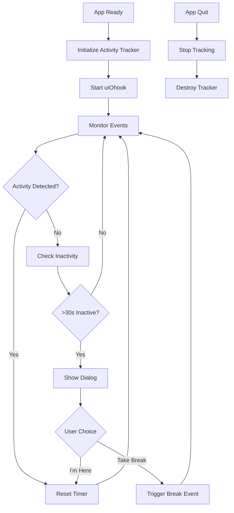

# Activity Tracker Guide

## 🎯 Overview

The Activity Tracker monitors user keyboard and mouse activity using `uiohook-napi` and displays a dialog when no activity is detected for 30 seconds. This helps ensure productivity and prevents idle time.

---

## 📦 Components

### 1. **`electron/activity-tracker.js`**
Core module that handles activity monitoring using native hooks.

### 2. **`electron/main.js`** (Integration)
Initializes and manages the activity tracker lifecycle.

### 3. **`electron/preload.js`** (API Exposure)
Exposes activity tracker methods to the renderer process.

### 4. **Type Definitions** (`components/electron-provider.tsx`)
TypeScript interface declarations for the activity tracker API.

---

## 🔧 How It Works

### Activity Detection
The tracker uses `uiohook-napi` to monitor:
- **Mouse Events**: `mousemove`, `mousedown`, `mouseup`, `click`, `wheel`
- **Keyboard Events**: `keydown`, `keyup`

### Inactivity Detection
- Checks every **5 seconds** if user has been inactive
- Shows dialog after **30 seconds** of no activity
- Configurable timeout via API

### Dialog Options
When inactivity is detected, the user sees a dialog with two options:
1. **"I'm Here"** - Resets the activity timer
2. **"Take a Break"** - Triggers a break request event

---

## 🚀 Usage

### In Electron Main Process

```javascript
// Already initialized in electron/main.js
const activityTracker = require('./activity-tracker')

// Initialize with main window reference
activityTracker.initialize(mainWindow)

// Get current status
const status = activityTracker.getStatus()
console.log(status)
// {
//   isTracking: true,
//   lastActivityTime: 1697120400000,
//   inactivityDuration: 15000,
//   isInactive: false,
//   inactiveSeconds: 15
// }

// Change timeout (e.g., 60 seconds)
activityTracker.setInactivityTimeout(60000)

// Stop tracking
activityTracker.stopTracking()

// Start tracking again
activityTracker.startTracking()

// Clean up (automatically called on app quit)
activityTracker.destroy()
```

---

### In React Components

```typescript
'use client'

import { useEffect, useState } from 'react'

export default function ActivityMonitor() {
  const [activityStatus, setActivityStatus] = useState<any>(null)

  useEffect(() => {
    // Check if in Electron
    if (!window.electron?.activityTracker) return

    // Get status
    async function checkStatus() {
      const status = await window.electron.activityTracker.getStatus()
      setActivityStatus(status)
    }

    checkStatus()
    const interval = setInterval(checkStatus, 5000)

    // Listen for break requests
    const unsubscribe = window.electron.activityTracker.onBreakRequested(() => {
      console.log('Break requested by activity tracker')
      // Handle break request (e.g., navigate to break page)
      window.location.href = '/breaks'
    })

    return () => {
      clearInterval(interval)
      unsubscribe()
    }
  }, [])

  if (!window.electron?.isElectron) {
    return null // Not in Electron
  }

  return (
    <div className="p-4 bg-gray-800 rounded">
      <h3 className="text-lg font-bold">Activity Status</h3>
      {activityStatus && (
        <div className="mt-2 space-y-1 text-sm">
          <p>Tracking: {activityStatus.isTracking ? '✅' : '❌'}</p>
          <p>Inactive for: {activityStatus.inactiveSeconds}s</p>
          <p>Status: {activityStatus.isInactive ? '⚠️ Inactive' : '✅ Active'}</p>
        </div>
      )}
    </div>
  )
}
```

---

### Control Activity Tracking

```typescript
'use client'

import { useState } from 'react'

export default function ActivityTrackerControls() {
  const [timeout, setTimeout] = useState(30)

  const handleStart = async () => {
    await window.electron?.activityTracker?.start()
    console.log('Activity tracking started')
  }

  const handleStop = async () => {
    await window.electron?.activityTracker?.stop()
    console.log('Activity tracking stopped')
  }

  const handleSetTimeout = async () => {
    await window.electron?.activityTracker?.setTimeout(timeout * 1000)
    console.log(`Timeout set to ${timeout} seconds`)
  }

  if (!window.electron?.isElectron) return null

  return (
    <div className="p-4 space-y-4">
      <h3 className="text-lg font-bold">Activity Tracker Controls</h3>
      
      <div className="flex gap-2">
        <button
          onClick={handleStart}
          className="px-4 py-2 bg-green-600 rounded hover:bg-green-700"
        >
          Start Tracking
        </button>
        
        <button
          onClick={handleStop}
          className="px-4 py-2 bg-red-600 rounded hover:bg-red-700"
        >
          Stop Tracking
        </button>
      </div>

      <div className="flex items-center gap-2">
        <label>Timeout (seconds):</label>
        <input
          type="number"
          value={timeout}
          onChange={(e) => setTimeout(Number(e.target.value))}
          className="px-3 py-1 bg-gray-700 rounded"
          min="10"
          max="300"
        />
        <button
          onClick={handleSetTimeout}
          className="px-4 py-2 bg-blue-600 rounded hover:bg-blue-700"
        >
          Set Timeout
        </button>
      </div>
    </div>
  )
}
```

---

## 📋 API Reference

### TypeScript Interface

```typescript
interface ActivityTrackerAPI {
  // Get current activity status
  getStatus(): Promise<{
    isTracking: boolean
    lastActivityTime: number
    inactivityDuration: number
    isInactive: boolean
    inactiveSeconds: number
  }>

  // Start activity tracking
  start(): Promise<{ success: boolean }>

  // Stop activity tracking
  stop(): Promise<{ success: boolean }>

  // Set inactivity timeout (in milliseconds)
  setTimeout(milliseconds: number): Promise<{ success: boolean }>

  // Listen for break requests from the activity tracker
  onBreakRequested(callback: () => void): () => void
}
```

---

## 🎨 Integration with Break System

The activity tracker integrates seamlessly with the break system:

```typescript
// In your breaks component
useEffect(() => {
  if (!window.electron?.activityTracker) return

  // When activity tracker requests a break, show break selector
  const unsubscribe = window.electron.activityTracker.onBreakRequested(() => {
    // Show break selection dialog or automatically start a break
    setShowBreakDialog(true)
  })

  return unsubscribe
}, [])
```

---

## ⚙️ Configuration

### Change Inactivity Timeout

**Default:** 30 seconds

```javascript
// In electron/main.js or via IPC
activityTracker.setInactivityTimeout(60000) // 60 seconds
```

### Change Check Interval

Edit `electron/activity-tracker.js`:

```javascript
constructor() {
  // ...
  this.checkInterval = 10000 // Check every 10 seconds
}
```

---

## 🐛 Debugging

### Enable Detailed Logging

The activity tracker logs all events to the console:

```bash
[ActivityTracker] Initializing...
[ActivityTracker] Starting activity monitoring...
[ActivityTracker] uIOhook started successfully
[ActivityTracker] Inactivity checker started
[ActivityTracker] Inactivity detected: 30 seconds
[ActivityTracker] User response: I'm Here
```

### Check Status Programmatically

```typescript
const status = await window.electron?.activityTracker?.getStatus()
console.log('Activity Status:', status)
```

---

## 🔒 Security & Privacy

- **Local Only**: All tracking happens locally on the user's machine
- **No Data Collection**: Activity events are not stored or transmitted
- **Transparent**: Dialog clearly notifies the user when inactivity is detected
- **User Control**: Users can choose to continue working or take a break

---

## 🚨 Troubleshooting

### Issue: Dialog not showing

**Solution:**
- Check console for `[ActivityTracker]` logs
- Verify `uiohook-napi` is installed: `npm list uiohook-napi`
- Ensure activity tracker is initialized in main.js

### Issue: Native module error

**Solution:**
```bash
# Rebuild native modules for Electron
npm install --save-dev @electron/rebuild
npx electron-rebuild
```

### Issue: Tracking not starting

**Solution:**
- Check permissions (on macOS, requires Accessibility permissions)
- Verify main window is created before initializing tracker
- Check if tracking is already started

---

## 📊 Performance Impact

- **CPU Usage**: Minimal (<1%)
- **Memory Usage**: ~5-10 MB
- **Event Overhead**: Native hooks are highly optimized
- **Check Interval**: Configurable (default: 5 seconds)

---

## 🎯 Best Practices

1. **Initialize After Window Creation**: Always initialize after main window is ready
2. **Clean Up**: Call `destroy()` on app quit (already handled)
3. **Handle Break Requests**: Listen to `onBreakRequested` in your break component
4. **Configure Timeout**: Adjust based on your workflow (30-60 seconds recommended)
5. **Test Thoroughly**: Test on all target platforms (Windows, macOS, Linux)

---

## 🔄 Lifecycle



---

## 📝 Example: Complete Integration

```typescript
// components/activity-aware-app.tsx
'use client'

import { useEffect, useState } from 'react'

export default function ActivityAwareApp({ children }: { children: React.ReactNode }) {
  const [showBreakDialog, setShowBreakDialog] = useState(false)

  useEffect(() => {
    if (!window.electron?.activityTracker) return

    // Set custom timeout (45 seconds)
    window.electron.activityTracker.setTimeout(45000)

    // Listen for break requests
    const unsubscribe = window.electron.activityTracker.onBreakRequested(() => {
      console.log('[App] Activity tracker requested break')
      setShowBreakDialog(true)
    })

    return unsubscribe
  }, [])

  if (showBreakDialog) {
    return (
      <div className="fixed inset-0 flex items-center justify-center bg-black/80">
        <div className="bg-gray-800 p-8 rounded-lg">
          <h2 className="text-2xl font-bold mb-4">Time for a Break?</h2>
          <p className="mb-6">You've been inactive. Would you like to take a break?</p>
          <div className="flex gap-4">
            <button
              onClick={() => setShowBreakDialog(false)}
              className="px-6 py-2 bg-gray-600 rounded"
            >
              Keep Working
            </button>
            <button
              onClick={() => {
                setShowBreakDialog(false)
                window.location.href = '/breaks'
              }}
              className="px-6 py-2 bg-blue-600 rounded"
            >
              Take Break
            </button>
          </div>
        </div>
      </div>
    )
  }

  return <>{children}</>
}
```

---

**Status:** ✅ Fully Implemented and Integrated

**Last Updated:** October 13, 2025


